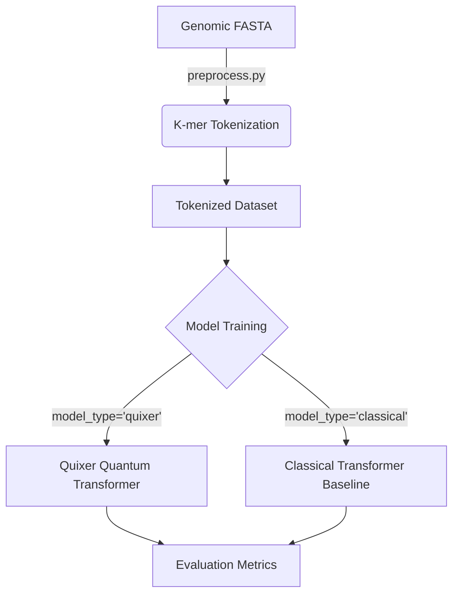

# Genomic Quixer: Quantum Next-Token Prediction for Genomics

This project implements a **Quantum Transformer (Quixer)** for genomic sequence modeling (Next-Base Prediction). It compares the performance of a quantum-enhanced attention mechanism (LCU + QSVT) against a classical transformer baseline on genomic data.

## 🧬 Pipeline Overview

The pipeline focuses on **K-mer Tokenization** and **Next-Token Prediction**, treating DNA sequences like language.



## 📂 Project Structure

The codebase is organized as a modular Python package `genomic_quixer`:

```text
.
├── genomic_quixer/             # Main Package
│   ├── data/
│   │   ├── dataset.py          # Memory-efficient Dataset class
│   │   └── preprocess.py       # K-mer tokenization logic
│   ├── models/
│   │   ├── quixer.py           # Quantum Transformer (Ansatz 14 + LCU/QSVT)
│   │   └── classical.py        # Classical Transformer Baseline
│   └── training/
│       └── trainer.py          # Training loops and visualization
├── train.py                    # Main entry point for training
├── preprocess.py               # Entry point for data generation
└── legacy_lambeq/              # Archive of previous Lambeq experiments
```

## 🚀 Quick Start

### 1. Preprocess Data
Convert raw FASTA sequences into K-mer tokens.

```bash
# Default: 4-mer tokenization (Vocab size = 256)
python preprocess.py --k_mer 4
```

### 2. Train Quixer (Quantum Model)
Train the quantum transformer model.

```bash
python train.py \
    --model_type quixer \
    --epochs 10 \
    --batch_size 256 \
    --window_size 128 \
    --qubits 6
```

### 3. Train Classical Baseline
Train a classical transformer with comparable parameters.

```bash
python train.py \
    --model_type classical \
    --epochs 10 \
    --batch_size 256 \
    --window_size 128
```

## 📊 Key Features

- **Quixer Model**: Uses `TorchQuantum` to simulate parameterized quantum circuits (Ansatz 14) with Linear Combination of Unitaries (LCU) and Quantum Singular Value Transformation (QSVT).
- **Efficient Data Loading**: Uses memory mapping (`mmap`) to handle large genomic datasets without loading everything into RAM.
- **Direct Comparison**: Unified training script allowing side-by-side comparison of Quantum vs Classical approaches on the same data splits.

## 🛠 Dependencies

- `torch`
- `torchquantum`
- `numpy`
- `tqdm`
- `matplotlib`

---
*Note: This pipeline replaces the previous Lambeq-based approach. Old files can be found in `legacy_lambeq/`.*
